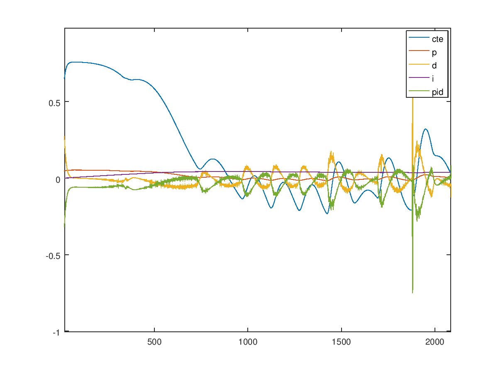

# CarND-Controls-PID
Self-Driving Car Engineer Nanodegree Program

---
## Introduction

In this project we revisit the lake race track from the Behavioral Cloning Project.This time, however, I implement a PID controller in C++ to maneuver the vehicle around the track!

The simulator provides the cross track error (CTE) and the velocity (mph) in order to compute the appropriate steering angle and velocity control of the car.
The speed limit has been increased from 30 mph to 100 mph so the objective is to try to drive SAFELY as fast as possible! NOTE: There is no minimum speed to pass.

## Implementation

The car steering PID controller follows the base implementation taught in class consiting of a proportional, integral, and derivative component.  It was coded in C++ and is located in the files ```PID.h``` and ```PID.cpp```.  The PID gains were tuned manually following well established tuning methods stated [here](https://robotics.stackexchange.com/questions/167/what-are-good-strategies-for-tuning-pid-loops).  Once the car could safely navigate around the track, a Twiddle algorithm, as shown in class, was then applied to improve upon it as it drives the total error to zero.


The car throttle control was implemented with a PID controller as well.  The gains were manually tuned and the Twiddle algorithm applied to fine tune it.  Surprisingly, it settled on a controller that did not use the I term which resulted in a PD controller, a special case of the PID controller where the I term is set to zero.

See https://en.wikipedia.org/wiki/PID_controller for more information.

## Reflection

The following section describes the effect of each term on the implementation.

### Proportional Effect

The proportional effect is simply a gain factor applied to the error between desired and actual measured value.  As the error increases the proportional term increases in the opposite direction to counteract the error.

The effect of a single proportional term is shown in the plots below:


Here the line in blue shows the cross track error over time (steps). This is a P only controller with D and I terms set to zero.  It can be seen that as the cte term increases, so does the proportional term shown in red.  The final result is an error value equal to the proportional but in the opposite direction to counteract the cross track error.


The effect of turning up the gain is quite dramatic and leads to larger occilations in the cross track error. This leads to an unstable condition and does not handle varying inputs very well.  A high proportional term makes the system more sensitive to error but becomes unbounded as error grows.  The effect is decreased response time, increased overshoot, decreased steady state error, and a degredation in stability.

Lowering the P term too much can also have bad effects where the car will fail to counteract the error leading to it not being sensititve to changes in the road curvature. It does not applify the error like the very large proportional term above, but it will also fail to handle the corners and bends in the road.


### Differential Effect

The effects of the differential term are emphasized in the plots below:


Here the derivative term works against the proportional term when the error term is changing rapidly. Therefore increasing the D term will necesstate a corresponding increase in the P term.  Here the D term helps with the oscillation in the P term but induces a steady state error in the cross track error but the controller is generally stable.


Increasing the D term too much causes the controller to go unstable as seen in plot above.  The effect is a decrease in overshoot, an increase in the time it takes to settle (ringing) as seen in the bell shape occilations.  The bells are growing over time which is sign that this D term will cause more instability over time.

### Integral Effect

The effects of modifying the integral term are shown in the plots below:



Here is a fully tuned PID controller with an small I term applied.  The I term integrates the error over time and applies it to the control output.  Notice how the blue cross track error is now corrected to be the center of the plot.  This is because the I term reduces steady state error.  Since this an 'area' function, the term must be small or risk the controller becoming unstable.  This cumulative effect will reduce the steady state error but requires error on the opposite side of the graph to pull it back down to zero.


Increasing the I term leads to unstability as seen in the above plot where the integral term is set to ```0.1```.  Here it can be seen that as the cross track error increases so does the I term. The effect of increasing the I term is a decrease in rise time, and increase in overshooting, and increase in the settling time, a decrease in steady state error and a degredation in stabilty.

### How the Final Hyperparameters Were Chosen

To get the final hyperparameters or P, I, D gains, I used a combination of manual tuning and Twiddle.

I initially set the throttle to ```.3``` and manually tuned the P, I, D following the methods described [here](https://robotics.stackexchange.com/questions/167/what-are-good-strategies-for-tuning-pid-loops) and in the document [here](https://udacity-reviews-uploads.s3.amazonaws.com/_attachments/41330/1493863065/pid_control_document.pdf).

1. I set all the terms to zero and gradually increased P until I could make the first corner without flying off or oscillating out of control.  When the occillations increased too much I lowered it until they stoped increasing.
2. I then set D term to a very small value and gradually increased it until the overshooting around the second an thrid corners was resolved.
3. Finally I set the I term from a very small amount ```1e-5``` to reduce the steady state error.  By this time the car was able to traverse a complete lap of the track.

I noticed that if I changed the throttle to ```0.4```, the P, I, D, terms were no longer valid and the car lost control.  The PID terms are dependant on the cars velocity.  This makes sense because as the car travels faster, more subtle changes are required.

At this point, I decided to implement throttle control with a PID controller and only tune for a single speed.

I manually tuned the speed control using the same logic above and it gave decent results. Once this was done, I implemented the Twiddle algorithm to fine tune the steering control.  

My version of the Twiddle algorithm lives in the PID class. It is turned on by specifying it in the initialization function.  The ```main.cpp``` loop listens for a return code from the PID ```UpdateError``` function that is used to signal restarts of the simulation pipeline.

After using the Twiddle algorithm to find the final gains for the ```40 MPH``` speed.  I then used Twiddle to fine tune the throttle once again.  After this, I found I needed to run Twiddle once more on the steering controller to dial it in nicely.

An issue I ran into early on in the process was twitchy turning responses.  It looked like the wheels were twitching back and forth extreamly fast while driving.  When I looked closer at the crosstack erro coming from the simulator itself, I noticed that after every new value, it would send 3 or more sensor readings of the same value.  This was causing the differential D term to fire once and then hold zero for a few updates and then fire again and so on.

To fix this, I added a low pass filter to both the steering cross track error as wel as the velocity feedback.  This helped a lot with the control of the car and stopped the wheels from twitching all the time.

Another issue I had was that a fully tuned PID controller would produce different results from run to run.  I had initially just used the steps as the time increment for the differential control.  This introduced variability becuase the updates did not always occur at the same time interval.  Using ```std::chrono::system_clock``` instead resulted in a big improvement in this phenomina.

After I had a controller tuned for 40 MPH, I decided to tune PID gains for each speed in the range ```40, 50, 60, 70, 80, and 90 MPH```.  I started the ```50 MPH``` with the same parameters from the previous speed, ```40 MPH```, and applied the Twiddle algorithm these until it could successfully complete a lap and assigned the vales for this new speed. I repeated this for each speed up to ```90 MPH```.  At ```90 MPH``` I found the Twiddle algorithm would no longer work as the car could never make the first sharp corner after the bridge.  It should be noted that using a low pass filter on the cross track error results in a time delay between the input and the control. It becomes slower to respond.  This works against tuning the controller for high speed driving.

In the end I was content to settle for ```80 MPH``` as the maximum speed I could attain safely.

## Simulation Results

### The vehicle must successfully drive a lap around the track.

No tire may leave the drivable portion of the track surface. The car may not pop up onto ledges or roll over any surfaces that would otherwise be considered unsafe (if humans were in the vehicle).

Here are the results of running the simulator at the ```40 MPH``` setting and the ```80 MPH``` setting with both cars completing one lap of the lake course.

### 40 MPH


Here the cart is more or less centered in the lane and performs fairly well, avoiding sudden movements.  I would actually get into this car.

### 80 MPH


Here we see that there is some additional side to side movement as it negotiates the track.  The wheels do drive over the painted sections of the road during the turns but does not roll up onto the ledge.  This was the maximum speed I could attain with this controller. I would probably not like to get into this car at this speed!

## Dependencies

* cmake >= 3.5
 * All OSes: [click here for installation instructions](https://cmake.org/install/)
* make >= 4.1(mac, linux), 3.81(Windows)
  * Linux: make is installed by default on most Linux distros
  * Mac: [install Xcode command line tools to get make](https://developer.apple.com/xcode/features/)
  * Windows: [Click here for installation instructions](http://gnuwin32.sourceforge.net/packages/make.htm)
* gcc/g++ >= 5.4
  * Linux: gcc / g++ is installed by default on most Linux distros
  * Mac: same deal as make - [install Xcode command line tools]((https://developer.apple.com/xcode/features/)
  * Windows: recommend using [MinGW](http://www.mingw.org/)
* [uWebSockets](https://github.com/uWebSockets/uWebSockets)
  * Run either `./install-mac.sh` or `./install-ubuntu.sh`.
  * If you install from source, checkout to commit `e94b6e1`, i.e.
    ```
    git clone https://github.com/uWebSockets/uWebSockets 
    cd uWebSockets
    git checkout e94b6e1
    ```
    Some function signatures have changed in v0.14.x. See [this PR](https://github.com/udacity/CarND-MPC-Project/pull/3) for more details.
* Simulator. You can download these from the [project intro page](https://github.com/udacity/self-driving-car-sim/releases) in the classroom.

There's an experimental patch for windows in this [PR](https://github.com/udacity/CarND-PID-Control-Project/pull/3)

## Basic Build Instructions

1. Clone this repo.
2. Make a build directory: `mkdir build && cd build`
3. Compile: `cmake .. && make`
4. Run it: `./pid`.
5. Run it with some speed [40,50,60,70,80]: `./pid <speed>`. 
6. Run it with Twiddle: `./pid <Kp> <Kd> <Ki> <speed>`.


Tips for setting up your environment can be found [here](https://classroom.udacity.com/nanodegrees/nd013/parts/40f38239-66b6-46ec-ae68-03afd8a601c8/modules/0949fca6-b379-42af-a919-ee50aa304e6a/lessons/f758c44c-5e40-4e01-93b5-1a82aa4e044f/concepts/23d376c7-0195-4276-bdf0-e02f1f3c665d)

## Editor Settings

* indent using spaces
* set tab width to 2 spaces (keeps the matrices in source code aligned)

## Code Style

This code follows the [Google's C++ style guide](https://google.github.io/styleguide/cppguide.html).

## Project Instructions and Rubric

More information is only accessible by people who are already enrolled in Term 2
of CarND. If you are enrolled, see [the project page](https://classroom.udacity.com/nanodegrees/nd013/parts/40f38239-66b6-46ec-ae68-03afd8a601c8/modules/f1820894-8322-4bb3-81aa-b26b3c6dcbaf/lessons/e8235395-22dd-4b87-88e0-d108c5e5bbf4/concepts/6a4d8d42-6a04-4aa6-b284-1697c0fd6562)
for instructions and the project rubric.

## References

1. https://robotics.stackexchange.com/questions/167/what-are-good-strategies-for-tuning-pid-loops

2. https://udacity-reviews-uploads.s3.amazonaws.com/_attachments/41330/1493863065/pid_control_document.pd

3. https://en.wikipedia.org/wiki/PID_controller
